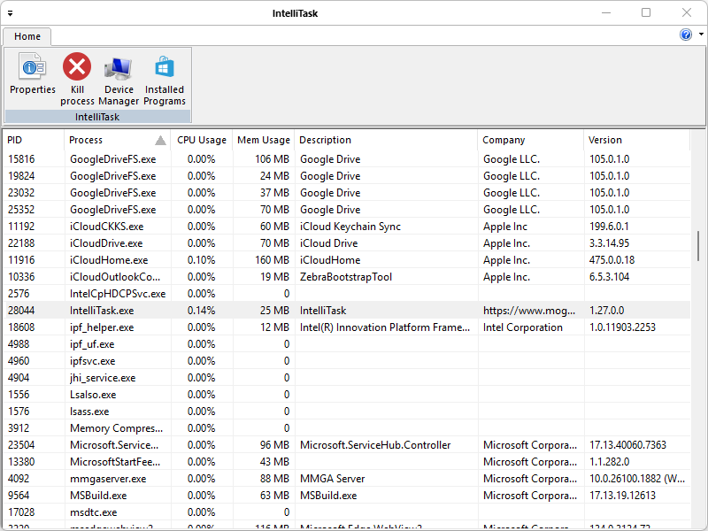

[IntelliTask](https://www.emvs.site/intellitask/) provides information about processes and services running on your computer. It also displays the most commonly used performance measures for processes. You can use IntelliTask to monitor key indicators of your computer’s performance. You can see the status of the programs that are running and end programs that have stopped responding. You can also assess the activity of running processes using as many as fifteen parameters, and see graphs and data on CPU and memory usage. In addition, if you are connected to a network, you can view network status and see how your network is functioning. Running in the Microsoft Windows environment, its use is governed by [GPL License](LICENSE). Contributions are welcome. Be mindful of our [Contribution Rules](CONTRIBUTING.md) to increase the likelihood of your contribution getting accepted.
